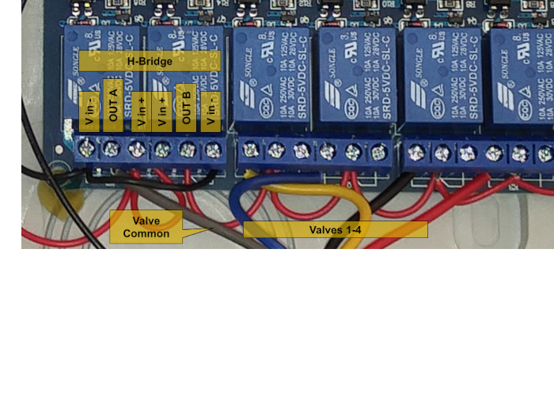

# Custom Fork of Opensprinkler-Firmware

### Purpose
This fork contains modifications to the original firmware to support a non-standard, simplified hardware configuration.
It is meant to drive **latching valves (DC)** without an I2C expander, via relays, directly with GPIO pins (Option A below), with minimal investment
A small number of valves is supported (number of available GPIO pins minus 1). 

### Hardware

*Note*: comment out/in `HW_TYPE_DIRECTLATCH_SUBTYPE_HC595_X16` in `akomdefines.h` to decide between these options:

#### Option A: Generic ESP8266 and a relay board, 4-6 zones.
* **ESP8266**: Wemos D1 Mini or similar
* **Relays**: An optocoupler multi-relay board (2 SPDT relays are used as an H-Bridge)
* **5V Power**: To power the ESP and relay board (I'm using an **LM7805** from the 12v)
* **?V DC**:  Valve-appropriate voltage. (My whole system works fine from a single 9v 350mA adapter)
* **Capacitor**: if using a single voltage source like I am (prevents brownouts during valve operation)  I used a 2200uF electrolytic.

#### Option B: A 16 relay ESP8266 integrated board (board with two HC595 shift registers), 14 zones

* **The 16 relay ESP8266 board from China**: These come in 5V, 12V and 24V versions
* **Power Supply**
* **Capacitor, as needed** (I don't seem to need it, I am running a 24V ESP board off a 12V 400mA adapter and that operates the Melnor valves and the board)
* Obviously some wires, connectors and enclosure would be helpful, not to mention valves (I'm using gutted timers, see below)

### Limitations

* No display, no buttons, no expander, no booster, no RTC (relies on NTP).  
* Only WiFi access
* 6-14 valves.

### Logic

The logic is slightly different from the standard Opensprinkler "Latch" type:

* Turning a valve **on**: pulse that station relay **ON**
* Turning a valve **off**: (simultaneously:)
  * pulse H-Bridge relay **ON** (reverses polarity)
  * pulse that station relay **ON**
  
### Circuit

#### Option A

[PDF Format](https://raw.githubusercontent.com/akomakom/OpenSprinkler-Firmware-CustomLatch/master/readme/latching-sprinkler-circuit.pdf)

#### Option B

Wiring is dramatically simpler since the ESP8266 is prewired to the relays.  
First two relays are used for H-Bridge the same way as in Option A

### Design decisions

#### Option A
* **H-Bridge**: The first two relays are used for the H-Bridge. Both relays are driven from pin D0.  It can also be a single DPDT relay.
* Station relays start with **D3** (D3-D8) because D1 and D2 are used for I2C and I don't feel like changing that code.
* I am driving **4 valves** in real life so the schematic only connects 4 (+2 for H-Bridge).  The other 4 stations in the UI do nothing.
* The **valves** I am using are actually a commodity hose timer (a Melnor 73280), with internal circuitry disconnected and latching valves wired directly to my relays.
* I needed a **capacitor** to stabilize power supply to the ESP8266 because of voltage drop (or spikes) when valves cycled.  You may not.  I used what I had handy.

#### Option B
* **H-Bridge**: The first two relays are used for the H-Bridge, leaving 14 usable stations.  Jumper wires are the same as for Option A.
* **Valves**: I am still using gutted Melnor timers (multiple) like in Option A.

